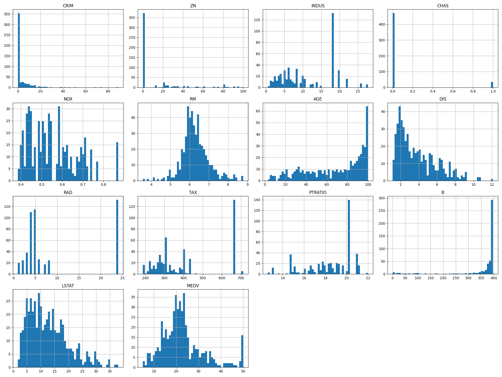

### 🏠 Boston House Pricing Prediction – Linear Regression

A **Machine Learning** project that predicts **house prices in Boston** using **Linear Regression**.  
This project demonstrates **end-to-end model development**, from data preprocessing to model deployment.


## 📌 Project Overview
The aim of this project is to build and deploy a **predictive model** that estimates Boston house prices based on multiple features such as crime rate, average number of rooms, property tax rate, and more.  
It follows the complete **Machine Learning pipeline**:
1. Data Loading & Exploration  
2. Data Preprocessing & Feature Engineering  
3. Model Training (Linear Regression)  
4. Model Evaluation  
5. Model Saving & Deployment  


## 🛠 Tech Stack
- **Programming Language:** Python 🐍
- **Libraries:** Pandas, NumPy, Scikit-learn, Matplotlib
- **Deployment:** Flask (optional: Heroku)
- **Version Control:** Git & GitHub


## 📊 Dataset Information
The dataset contains housing data for suburbs of Boston with features such as:
- **CRIM** – Per capita crime rate
- **RM** – Average number of rooms per dwelling
- **LSTAT** – % of lower status of the population
- **PTRATIO** – Pupil-teacher ratio by town
- **MEDV** – Median value of owner-occupied homes (target variable)

**Target:** `MEDV` – Median value of houses in $1000s.


#### Sofware And Tools Requirements

1. [Github Account](https://github.com)
2. [HerokuAccount](https://heroku.com)
3. [VSCodeIDE](https://code.visualstudio.com/)
4. [GitCLI](https://git-scm.com/book/en/v2/getting-Started-The-Command-Line)


### Create a virtual environment

```bash
python -m venv venv
```

Activate it:

```bash
source venv/Scripts/activate
```

### Install dependencies

```bash
pip install -r requirements.txt
```


## 📈 Model Performance

The **Linear Regression** model achieved the following performance:

* **R² Score:** \~0.73
* **RMSE:** \~4.7

> These results may vary slightly depending on preprocessing and random train-test split.


## 📸 Visualizations

Example: Distribution of `MEDV` (House Prices) in the dataset.




## 🌐 Deployment (Optional)

You can deploy the trained model using Flask locally or host it online using **Heroku**.

Run locally:

```bash
python app.py
```

The app will be accessible at `http://127.0.0.1:5000`.

---

## 📜 License

This project is licensed under the **Apache 2.0 License** – see the [LICENSE](LICENSE) file for details.

---

## ✨ Author

**Your Name**
🔗 [LinkedIn](https://linkedin.com/in/yourusername) | [GitHub](https://github.com/yourusername)

```

---

If you want, I can also **add GitHub badges** (Python version, License, Last Commit, Open Issues) at the top so it looks more professional and eye-catching for recruiters browsing your repo.  
Do you want me to add those badges too?
```
